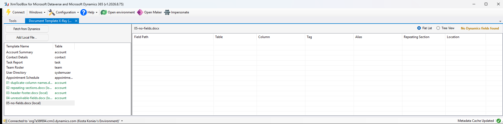

# Test fixtures

Word templates for exercising Document Template XRay by hand — one per behaviour worth
seeing in a screenshot.

They are real `.docx` files: Word opens them, shows the content controls, and resolves the
bindings against the customXml part exactly as it does for a template downloaded from
Dynamics. `New-Fixtures.ps1` writes them from scratch, so the spec for a fixture is a
handful of readable lines rather than a binary blob nobody can diff.

```powershell
.\New-Fixtures.ps1                 # rebuild all of them
.\New-Fixtures.ps1 -Name "01-*"    # rebuild one
```

Every path uses out-of-the-box tables, columns and relationship schema names — `account`,
`contact`, `systemuser`, `task` — so display-name resolution works against any Dataverse
environment with no setup. `04` is the deliberate exception.

## What each one is for

### `01-duplicate-column-names.docx` — the point of the tool

Seventeen fields on four tables, chosen so the column names collide:

| Column | Appears on |
| --- | --- |
| `description` | Account, its parent Account, the primary Contact |
| `address1_city` | Account, its parent Account, the primary Contact, the owning User |
| `name` | Account, its parent Account |
| `fullname` | Contact, User |
| `emailaddress1`, `telephone1` | Account, Contact |

Open it in Word and the Notes section is three grey boxes in a row, each reading
`description`. Nothing on the page, in the content-control chrome, or in the XML Mapping
pane's flat view says which record each one comes from — the only difference is a data
binding you cannot see without going into the XML.

Load the same file in the tool and the Field Path column separates them
(`account/description` vs `account/account_parent_account/description` vs
`account/account_primary_contact/description`), and, when connected, the Table column names
the record each field is read from. Tree view makes the same point structurally: three
`description` leaves under three different parents.

**This is the screenshot to lead with.** Word and the tool side by side.

### `02-repeating-sections.docx` — repeating sections

Two repeating sections on one account: contacts (`contact_customer_accounts`) and tasks
(`Account_Tasks`). `description` and `createdon` appear at the root *and* inside both
sections, so the Repeating Section column is doing real work — it is what tells you the
second `description` repeats per contact and the third per task.

Expect the two section rows in bold blue with `(section)`, their children in blue and
tagged with the section name, and the root fields in plain black.

### `03-header-footer.docx` — header, footer, body

Seven fields spread over `word/document.xml`, `word/header1.xml` and `word/footer1.xml`.
`name` and `address1_city` each appear twice, from different tables, in different parts of
the document. Covers the Location column, and the case a reader would otherwise miss
entirely: fields that never show up if you only scroll the body.

### `04-unresolvable-fields.docx` — a stale template

Bindings to a table, a relationship and columns that do not exist (`xray_*`), mixed with
one that does. The extractor should still list all five with their paths; the Table and
Column columns stay blank for the ones metadata cannot resolve, and nothing throws. Use it
to check the tool degrades quietly against an environment the template was not built for.

### `05-no-fields.docx` — the empty case

An ordinary Word document with no bindings at all. Expect "No Dynamics fields found" in
amber rather than an error or an empty grid with no explanation.



This is also the fixture that catches toolbar layout regressions: it produces the longest
message the field-count label ever shows, so if that label is mispositioned it collides
with the view selector here first.

## Checking a fixture without the UI

`Get-DynamicsTemplateFields.ps1` in the repo root runs the same extraction logic from the
command line:

```powershell
..\Get-DynamicsTemplateFields.ps1 -TemplatePath .\01-duplicate-column-names.docx
..\Get-DynamicsTemplateFields.ps1 -TemplatePath .\02-repeating-sections.docx -Tree
```

It has no Dataverse connection, so it shows field paths only — display names need the
plugin. Everything about *which* fields are found should match what the tool lists.

## Taking the screenshots

`..\xtb.ps1` builds the tool and launches a private XrmToolBox with only it installed,
connected to the current `pac auth` environment. Then `Add Local File...` (or drag and
drop) each fixture from this folder.
